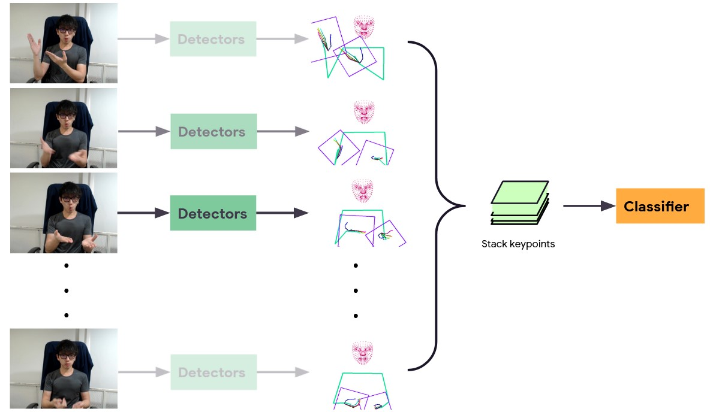
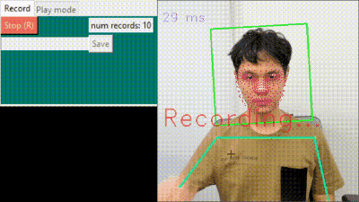
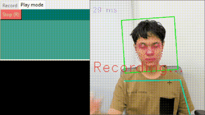

# Shuwa Gesture Toolkit

Shuwa (手話) is Japanese for "Sign Language"

Shuwa Gesture Toolkit is a framework that detects and classifies arbitrary gestures in short videos. It is particularly useful for recognizing basic words in sign language. We collected thousands of example videos of people signing Japanese Sign Language (JSL) and Hong Kong Sign Language (HKSL) to train the baseline model for recognizing gestures and facial expressions.

The Shuwa Gesture Toolkit also allows you to train new gestures, so it can be trained to recognize any sign from any sign language in the world.

[[Web Demo](https://shuwa-io-demo.uc.r.appspot.com/)]

# How it works

  
By combining pose, face, and hand detector results over multiple frames we can acquire a fairly requirement for sign language understanding includes body movement, facial movement, and hand gesture. After that we use DD-Net as a recognitor to predict sign features represented in the 832D vector. Finally using use K-Nearest Neighbor classification to output the class prediction.

All related models listed below.

- > [PoseNet](https://github.com/tensorflow/tfjs-models/tree/master/posenet): Pose detector model.
- > [FaceMesh](https://google.github.io/mediapipe/solutions/face_mesh) : Face keypoints detector model.
- > [HandLandmarks](https://google.github.io/mediapipe/solutions/hands) : Hand keypoints detector model.
- > [DD-Net](https://github.com/fandulu/DD-Net) : Skeleton-based action recognition model.

# Installation

- For MacOS user  
  Install python 3.7 from [`official python.org`](https://www.python.org/downloads/release/python-379/) for tkinter support.

- Install dependencies
  ```
  pip3 install -r requirements.txt 
  ```

# Run Python Demo

```
python3 webcam_demo_knn.py
```

- Use record mode to add more sign.  
  

- Play mode.  
  

# Run Detector demo

You can try each detector individually by using these scripts.

- FaceMesh

```
cd face_landmark
python3 webcam_demo_face.py
```

- PoseNet

```
cd posenet
python3 webcam_demo_pose.py
```

- HandLandmarks

```
cd hand_landmark
python3 webcam_demo_hand.py
```

# Deploy on the Web using Tensorflow.js

Instructions [`here`](/web_demo)

# Train classifier from scratch

You can add a custom sign by using Record mode in the full demo program.  
But if you want to train the classifier from scratch you can check out the process [`here`](/classifier)
